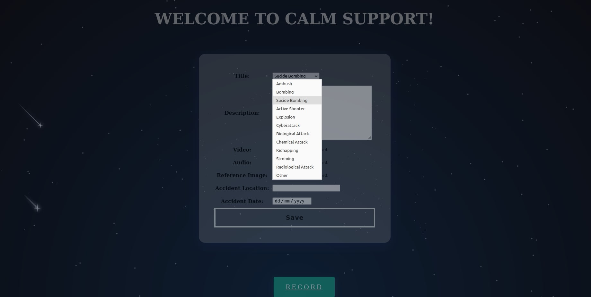
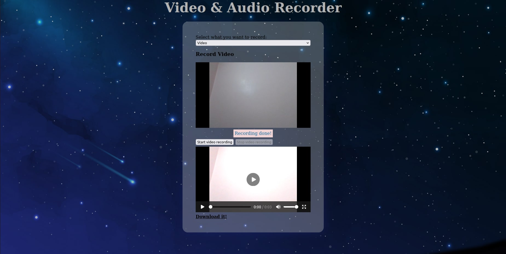
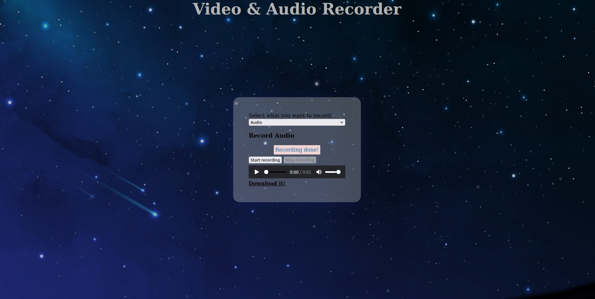
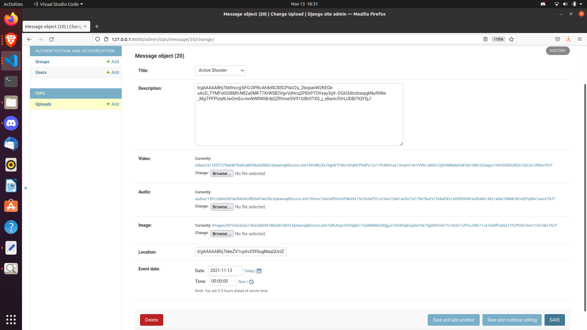

# **Calm Support** 

# **Hack this build 2.0** 

##  💼 &nbsp; **Theme :**  Anonymous Defence Tips

 🛠 &nbsp;Tech Stack

&nbsp;
&nbsp;
&nbsp;
&nbsp;

**Blockchain**,**WebRtc**,**SHA 256 Hashing**

----

## 🔭 &nbsp; About this Project

>Our web application will help people to share tips with the defence administration anonymously. It will provide a sense of privacy among the people and people shall come forward to provide tips as they will have no worries about their involvement in the interrogation.

>>We had used BlockChain as well as message encryption so as to provide very high level of cyber security to our system, minimizing the chances of data leak from cyber attacks. 

----

Click on the 
[Link](http://lovekesh.pythonanywhere.com/)
to Visit the Website.

----

## 🔭 &nbsp; Description of the Project

>**Step 1 :**  Fetch tips of user via website -either video/picture, audio or text.

>**Step 2 :**  Encrypting the messages that can be decrypted only by admin having the required keys

>**Step 3 :**  Decoding the message by admin and marking the message as spam or valid and taking required actions.

>**Step 4 :**  Automatic deletion of messages after 24 hours.

<!-- CONTRIBUTING -->

## Contributing

Contributions are what make the open source community such an amazing place to be learn, inspire, and create. Any contributions you make are **greatly appreciated**.

1. Fork the Project
2. Create your Feature Branch (`git checkout -b feature/AmazingFeature`)
3. Commit your Changes (`git commit -m 'Add some AmazingFeature'`)
4. Push to the Branch (`git push origin feature/AmazingFeature`)
5. Open a Pull Request
----
<!-- LICENSE -->
##     

Distributed under the MIT License. See `LICENSE` for more information.

